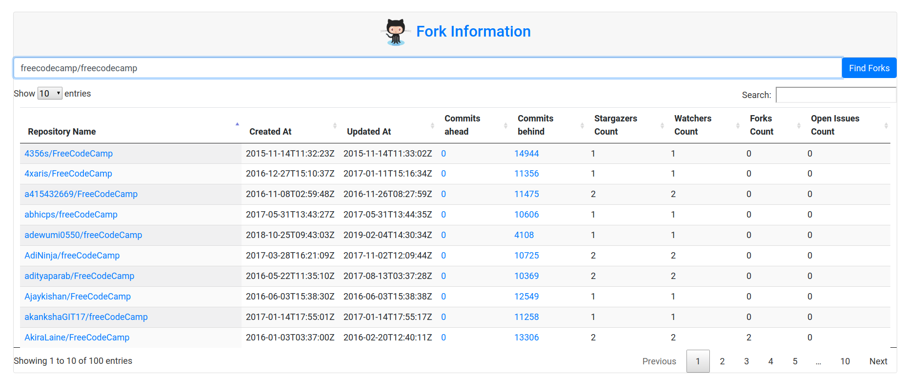

# ForkInfo
A [flask](http://flask.pocoo.org/) web app to get information about forks of a repository.

[Find Forks Here](https://forkinfo.herokuapp.com)

Found in stackoverflow answer: https://stackoverflow.com/questions/12208450/how-can-i-tell-who-forked-my-repository-on-github
